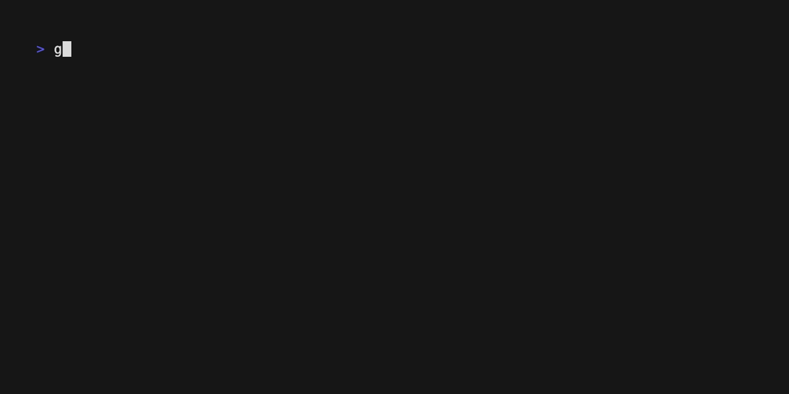

<div align="center">


# gitglimpse

**Turn your git history into standup updates, daily reports, and weekly summaries.**

[](https://python.org)
[](LICENSE)
[](CONTRIBUTING.md)

[Quick Start](#quick-start) · [Commands](#commands) · [Modes](#modes) · [Claude Code](#claude-code-integration) · [Configuration](#configuration)

<br>



</div>

---

gitglimpse reads your `git log`, groups commits into logical tasks, estimates how long each took, and formats everything as a standup, a report, or a weekly digest. Optionally, hand that context to an LLM — local or cloud — for a polished write-up.

> **This is a tool for developers, not managers.** No dashboards. No team tracking. No analytics. Just a fast way to remember and communicate what you worked on.

---

## Quick Start

```bash
pip install git+https://github.com/dino-zecevic/gitglimpse.git
cd your-project
glimpse standup
```

First run walks you through a one-time setup. After that, every command uses your saved preferences.

---

## Commands

### `glimpse standup`

Generate a standup update from recent commits.

```bash
glimpse standup                        # template output, no LLM needed
glimpse standup --json                 # structured JSON for piping to Claude Code
glimpse standup --local-llm            # polish with a local Ollama model
glimpse standup --since "3 days ago"   # custom time range
glimpse standup --context both         # send commits + diffs for richer output
```

```
Standup — March 28, 2026

Yesterday:
  • Implemented JWT refresh logic (feat/auth, ~2.5h)
  • Fixed pagination bug in orders endpoint (~0.5h)

Total estimated time: 3.0h
```

### `glimpse report`

Daily Markdown report with file-level detail — good for engineering journals or async updates.

```bash
glimpse report                  # print to terminal
glimpse report -o daily.md      # save to file
```

### `glimpse week`

Weekly digest grouped by day, with totals.

```bash
glimpse week                    # last 7 days
glimpse week --json             # structured output
glimpse week --since "14 days ago" --until "7 days ago"
```

### `glimpse init`

Generate Claude Code slash commands for your repo.

```bash
glimpse init                    # creates .claude/commands/{standup,report,week}.md
glimpse init --cursor           # also creates .cursor/commands/
```

### `glimpse config`

```bash
glimpse config show             # display current settings
glimpse config setup            # interactive setup wizard
```

---

## Modes

| Mode | Activate with | Requires |
|------|--------------|----------|
| **Template** | default | nothing — works offline |
| **Local LLM** | `--local-llm` or config | [Ollama](https://ollama.com) running locally |
| **Cloud API** | config setup | API key (OpenAI, Anthropic, or Gemini) |
| **JSON** | `--json` | nothing — designed for Claude Code / Cursor |

Template mode is instant and fully offline. LLM modes send commit context to a model for polished output. JSON mode outputs structured data for use with Claude Code or any LLM workflow.

---

## Claude Code Integration

This is where gitglimpse really shines. One slash command, instant standup.

**Setup:**

```bash
cd your-project
glimpse init
git add .claude/commands/
git commit -m "chore: add glimpse slash commands"
```

**Usage in Claude Code:**

```
> /standup
```

Claude Code reads the command file, runs `glimpse standup --json`, and formats a clean standup right in your terminal. No copy-pasting, no context switching.

**Why this matters for teams:** commit the `.claude/commands/` files to your repo. Every developer who pulls the code gets `/standup`, `/report`, and `/week` automatically. They install gitglimpse once and it just works. The repo itself becomes the distribution channel.

---

## Multi-Project Support

Run from a parent directory that contains multiple repos and gitglimpse aggregates everything.

<div align="center">

</div>

```
~/Projects/
  ├── api/
  ├── frontend/
  └── landing/
```

```bash
cd ~/Projects
glimpse standup
```

Use `--group task` for a flat list or `--group project` (default) for per-project grouping. Target specific repos with `--repos "api,frontend"`.

---

## The `--context` Flag

Controls how much detail goes into LLM summaries and JSON output.

| Value | What's sent | Best for |
|-------|------------|----------|
| `commits` | Commit messages only | Descriptive commit messages |
| `diffs` | Code diffs only | Vague or lazy commit messages |
| `both` | Messages + diffs | Maximum accuracy |

```bash
glimpse standup --context both --local-llm
```

---

## Configuration

First run triggers an interactive setup. Change settings anytime with `glimpse config setup`.

Config is stored at `~/.config/gitglimpse/config.toml` (macOS/Linux) or `%APPDATA%\gitglimpse\config.toml` (Windows).

```toml
default_mode = "local-llm"
llm_provider = "local"
llm_model = "qwen2.5-coder:latest"
local_llm_url = "http://localhost:11434/v1"
author_email = "you@example.com"
context_mode = "commits"
group_by = "project"
```

**API keys are never stored in the config file.** They're read from environment variables at runtime. During setup, gitglimpse can add the export line to your shell config.

CLI flags always override config values.

---

## How It Works

**Commit parsing** → reads `git log --pretty --numstat` for commits, file changes, branches, and timestamps.

**Task grouping** → clusters commits by branch and time proximity (3-hour gap = new task). Picks the most meaningful commit message as the summary. When messages are vague ("fix", "wip", "asdf"), infers meaning from file paths and change patterns.

**Duration estimation** → analyzes gaps between commits. Continuous work (gap < 2h) counts actual time. Breaks (gap > 2h) cap at 45 minutes. First commit assumes 30 minutes of prior work. Large changes get a 1.2× multiplier.

**Formatting** → template mode formats directly. LLM mode sends structured context (and optionally diffs) to the model. JSON mode outputs clean data for external tools. LLM output is validated — if a model goes off-script, it falls back to template automatically.

---

## Requirements

- Python 3.11+
- git

**Optional:**

- [Ollama](https://ollama.com) for local LLM mode
- An API key for cloud LLM mode (OpenAI, Anthropic, or Gemini)

---

## Philosophy

- **Privacy-first** — works fully offline, no telemetry, no tracking
- **Developer tool, not a manager tool** — helps you communicate your own work
- **LLM-optional** — useful without any AI, better with it
- **No vendor lock-in** — bring your own model, key, or use none at all

---

## Contributing

See [CONTRIBUTING.md](CONTRIBUTING.md) for setup instructions and guidelines.

---

## License

MIT — see [LICENSE](LICENSE) for details.

---

<div align="center">

Built by [Dino](https://dinoze.dev)

</div>